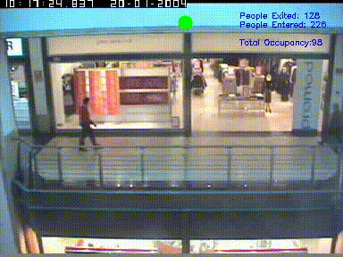

# Store-Occupancy-Measure. Application-of-Deep-SORT
This repository implements YOLOv3 and Deep SORT in order to measure Store Occupancy using Store entrance Surveillance camera with real-time object tracking. 
Yolov3 is an algorithm that uses deep convolutional neural networks to perform object detection. We can feed these object detections into Deep SORT (Simple Online and Realtime Tracking with a Deep Association Metric) in order for a real-time object tracker to be created.



### Description
In our collective fight against the coronavirus (COVID-19), we can all contribute — especially by keeping a safe physical distance from each other.
This application is one of few that helps in making ourselves maintaining a physical distance in Stores.
This functionality can be tied into an I/O device to control red/green status lights or an audio alert to ensure prompt guidance to customers. For example, a green light at the doorway indicating guests can enter the premise and flashing red light if the store is at full capacity. An audio message can warn a guest attempting to enter while the store is above capacity.
The above gif shows an alert when store reaches the occupancy of 100.

## Implementation

### Conda Requirements
You can install Conda for python which resolves all the dependencies for machine learning.

##### pip install requirements.txt

### Downloading official pretrained weights
For Windows:
You can download the yolov3 weights by clicking [here](https://pjreddie.com/media/files/yolov3.weights) and yolov3-tiny [here](https://pjreddie.com/media/files/yolov3-tiny.weights) then save them to the weights folder.


### Using Custom trained weights

Add your custom weights file to weights folder and your custom .names file into data/labels folder.
  
### Saving your yolov3 weights as a TensorFlow model.
Load the weights using `load_weights.py` script. This will convert the yolov3 weights into TensorFlow .tf model files!

```
# yolov3
python load_weights.py

# yolov3-tiny
python load_weights.py --weights ./weights/yolov3-tiny.weights --output ./weights/yolov3-tiny.tf --tiny

```
After executing one of the above lines, you should see proper .tf files in your weights folder. You are now ready to run object tracker.

## Running the Object Tracker
Now you can run the object tracker for the model you have created by changing the path of the video file in code and the output result video will be saved in the video folder.

There is a test video uploaded in the data/video folder called Mall_entry.mpg. If you followed all the steps properly with the pretrained coco yolov3.weights model then when your run the object tracker you should see the above video(gif).

vid = cv2.VideoCapture('./data/video/Mall_entry.mpg') 

```
python track.py
```
## Acknowledgments
* [Yolov3 TensorFlow Amazing Implementation](https://github.com/zzh8829/yolov3-tf2)
* [Deep SORT Repository](https://github.com/nwojke/deep_sort)
* [Yolo v3 official paper](https://arxiv.org/abs/1804.02767)
* https://www.youtube.com/watch?v=zJDUhGL26iU
* https://www.youtube.com/watch?v=zi-62z-3c4U&t=4262s
